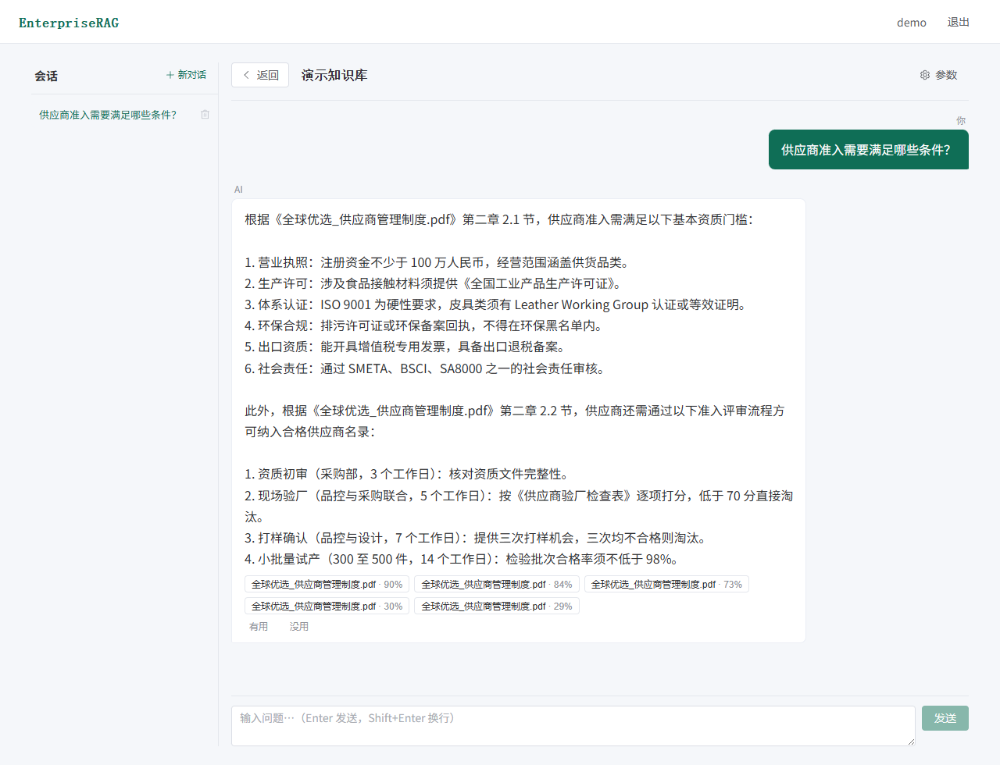
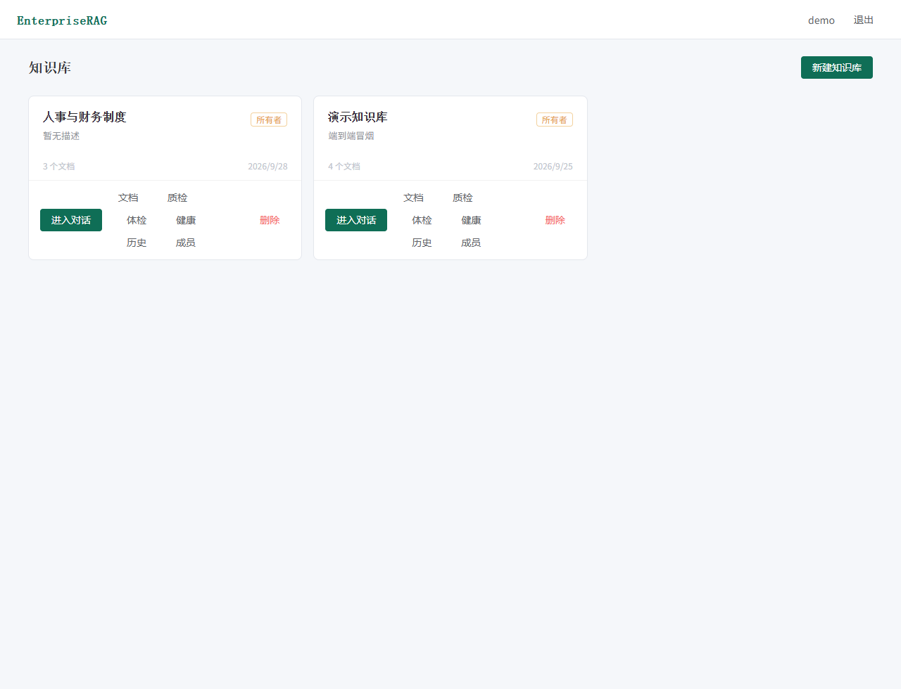
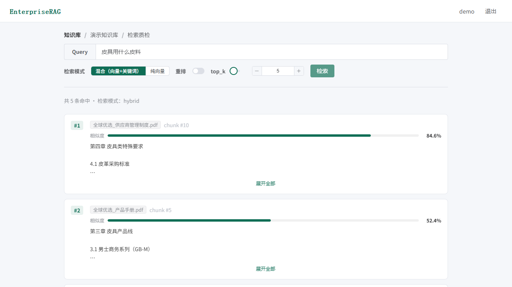

# Enterprise RAG System

**把散在共享盘里的企业文档，变成一个答得准、说得清、断网也能跑的知识库问答服务。**

一条提问走完全程：文档上传 → 解析 → 切片 → 向量化 → 检索（向量 + 关键词双路）→ 重排 → 流式生成 → **每条答案都能点回原文**。

> **后端 435 + 前端 58** 个测试用例全绿 · **31** 个 API 端点 · **11** 个前端页面 · **4** 种文档格式 · 全链路可离线运行

---

## 界面速览

**对话页** —— 流式生成 + 引用溯源 + 「有用 / 没用」反馈 + 检索参数（模式 / 条数 / 重排 / 模型）当场可调：



| 知识库（RBAC 角色徽章） | 检索质检台（命中切片 + 相似度分数条） |
|---|---|
|  |  |

## 一、为什么做这个

企业内部知识库的真实困境不是"没有数据"，而是**数据取不出来**：文档散在共享盘、格式五花八门、新人只能问老人。直接拿通用大模型问答会撞上两堵墙——

| 问题 | 本系统的应对 |
|---|---|
| **幻觉**：模型编造一个不存在的制度条款 | 答案强制带来源引用（文件名 + 切片序号 + 相似度），点击回到原文切片 |
| **数据出不去**：企业内部文档不能发到公网 API | 供应商层可插拔，`mock` 供应商让全链路**完全离线**跑通；换私有化模型只需改 `.env` |
| **检索是黑盒**：答错了不知道卡在哪一环 | 四个可观测面板：检索质检台 / 摄取诊断 / 问答日志 / 文档健康 |

这不是一个"调通 API 就完事"的 demo。检索质量问题要在**切片策略、检索融合、重排**三个环节上解决，系统把这三处都做成了可配置、可对比、可验收的能力。

## 二、系统架构

```text
┌────────────────────────────────────────────────────────────────────────────┐
│                前端  ·  Vue3 + Vite + Element Plus + Pinia                 │
│                 登录 · 知识库管理 · 文档上传 · 对话(流式)                  │
│           质检台 · 摄取诊断 · 问答日志 · 文档健康                          │
└────────────────────────────────────────────────────────────────────────────┘
                                       │  HTTPS + JWT
                                       ▼
┌────────────────────────────────────────────────────────────────────────────┐
│                             API 层  ·  FastAPI                             │
│         鉴权 JWT · RBAC 角色门槛 · 知识库 · 文档 · 问答(SSE 流式)          │
│      检索质检 · 摄取诊断 · 向量一致性 · 问答日志 · 文档健康                │
└────────────────────────────────────────────────────────────────────────────┘
                                       │
                                       ▼
┌────────────────────────────────────────────────────────────────────────────┐
│                                  核心引擎                                  │
│    摄取  解析(PDF/DOCX/MD/TXT) → 切片(fixed / structure / 语义) → Embedding│
│       问答   检索(向量 + 关键词混合) → Rerank → 生成 LLM + 溯源引用        │
└────────────────────────────────────────────────────────────────────────────┘
                                       │
                                       ▼
┌────────────────────────────────────────────────────────────────────────────┐
│                                   数据层                                   │
│   元数据   SQLite（默认）/ PostgreSQL   ·  User / KB / Document / QaLog    │
│  向量库   ChromaDB（默认）/ pgvector   ·   每个知识库 = 独立集合 kb_{id}   │
└────────────────────────────────────────────────────────────────────────────┘
                                       │
                                       ▼
┌────────────────────────────────────────────────────────────────────────────┐
│                            模型供应商（可插拔）                            │
│  通义千问 DashScope  ·  智谱 GLM  ·  重排 gte-rerank  ·  mock（离线可测）  │
└────────────────────────────────────────────────────────────────────────────┘
```

完整版（含 mermaid 渲染与两条数据流时序）见 [`docs/architecture.md`](docs/architecture.md)。

## 三、能验收的能力

每一行都对应一个可动手验证的动作。

| 能力 | 验收动作 | 关键实现 |
|---|---|---|
| **多租户知识库隔离** | 内置就有两个库（kb_1 业务制度 / kb_2 人事财务）。在 kb_2 里问一句只在 kb_1 有答案的（如「美国站的退货窗口是多少天？」），应正确拒答而不是串味 | 向量库按库物理隔离（`kb_{id}` 集合），检索按 `kb_id` 过滤 |
| **文档摄取** | 传 PDF / DOCX / MD / TXT，看状态从 pending → processing → indexed | `SUPPORTED_EXTS` 注册表 + 每种格式独立解析器（md 也剥语法标记） |
| **三档切片策略** | 同一份文档用 `fixed` / `structure` / `semantic` 各切一次，对比块边界 | 结构优先（标题/编号条款作块起点）零成本；语义档叠加句级 embedding 找断点 |
| **混合检索** | 搜一个**精确型号/代码**（如 `ERR-4032`），切 `vector` 与 `hybrid` 看召回差异 | 中文 2-gram + 英文保序 tokenize，双路归一化加权融合 |
| **重排 Rerank** | 质检台里开关重排，对比检索分数与重排分数的排序变化 | `RerankProvider` 接口 + Noop / Mock / OpenAICompat 三实现 |
| **流式问答 + 溯源** | 提问看答案逐字吐出，每条引用可展开原文切片 | SSE 流式 + 引用元数据随流下发 |
| **多轮对话** | 先问"报销标准是多少"，再问"那出差呢"——指代能接上 | `QueryRewriter` 规则档离线可用；配真模型自动升级 LLM 改写 |
| **会话持久化** | 刷新页面，历史会话与消息仍在侧边栏 | `Conversation` / `ChatMessage` 表，服务端改写读库内历史 |
| **RBAC 权限** | 用 viewer 账号登录，写操作按钮置灰、后端同步拒绝 | `User.role` + `KnowledgeBaseMember`，owner/editor/viewer + admin 旁路 |
| **可观测四件套** | 质检台 / 摄取诊断 / 问答日志 / 文档健康逐页打开 | 向量一致性检查、死文档识别、命中热力图 |

## 四、3 分钟演示路径

```bash
# ① 零配置冒烟：不联网、不要任何 API Key，看完整链路跑通
python scripts/demo.py

# ② 起服务（两个终端）
python -m uvicorn app.main:app --reload          # 后端 http://127.0.0.1:8000
cd frontend && npm install && npm run dev        # 前端 http://127.0.0.1:5173
```

然后在浏览器里：**注册 → 建知识库 → 传一份 PDF → 提问 → 展开引用看原文**。
接着打开侧边栏的**质检台**，把重排开关拨一下，看同一个问题下排序如何变化——这是最能说明"检索不是黑盒"的一步。

内置演示数据分两个库，可以顺手验一下隔离：**kb_1「演示知识库」**放对外业务制度
（产品手册 / 供应商管理制度 / 跨境物流 / 跨境售后，4 份 PDF），**kb_2「人事与财务制度」**
放内部规章（员工手册 / 财务报销与差旅 / 出口退税，刻意混用 docx + md + pdf 三种格式）。
重灌语料用 `python scripts/reingest_sample_docs.py --preset business` 或 `--preset hr-finance`。

想接真模型，复制 `.env.example` 为 `.env`，填 `DASHSCOPE_API_KEY` 或 `ZHIPU_API_KEY` 即可，代码零改动。

## 五、三个值得展开的技术点

**1. 混合检索为什么必须做。** 纯向量检索在"精确词"上天然吃亏：员工搜工单号 `ERR-4032`、搜制度编号、搜产品型号，语义相似度帮不上忙，反而容易被语义相近但编号不同的内容挤掉。做法是中文切 2-gram、英文保序切词，向量与关键词两路各自归一化后加权融合。踩过的坑：ChromaDB 的 `$contains` **大小写敏感**，同一个编号的大小写变体召回结果不同——写进了 [`docs/bugfix-log.md`](docs/bugfix-log.md)。

**2. 语义切分要分两档，因为成本差一个量级。** `structure` 档只看文档结构（标题层级、编号条款）决定块边界，纯离线、零 token 成本，对制度/手册类文档效果已经很好；`semantic` 档在此基础上用句级 embedding 找语义断点，适合结构松散的会议纪要。做成可切换而不是只做贵的那个，是因为内网环境下 embedding 调用也是成本。

**3. 可降级设计是架构约束，不是补丁。** LLM / Embedding / Rerank 三套供应商各自抽象成接口并有 mock 实现，于是 **435 个后端测试用例全程不联网、不需要密钥**，`demo.py` 在任何一台干净机器上都能跑通。这条约束反过来逼出了更好的代码结构——供应商层与业务逻辑彻底解耦。

## 六、快速开始

### 方式一：容器（一条命令，含 PostgreSQL + pgvector）

```bash
docker compose up --build
# 浏览器打开 http://localhost:8080
```

起三个容器：`web`（nginx 托管 SPA 并反代 `/api`）、`api`（FastAPI）、`db`（`pgvector/pgvector:pg17`）。
默认 `VECTOR_STORE=pgvector`，元数据与向量共库；`RAG_PROVIDER=mock`，**不需要任何 API Key**。

想接真模型：编辑 `docker-compose.yml` 里 `api` 服务的 `RAG_PROVIDER` 为 `dashscope` / `zhipu`，填入对应 Key 后 `docker compose up -d`。

**国内网络拉不动基础镜像时**：`registry-1.docker.io` 常直连超时。**不要为此去配代理**
（Docker Desktop 走 WSL2 后端，流量不经过 Windows 的 TUN 网卡，配了也多半不通）。
直接从国内镜像源拉、再改回标准名即可，**全程不改任何 Docker 配置**：

```bash
M=docker.m.daocloud.io
for spec in library/python:3.11-slim library/node:22-alpine \
            pgvector/pgvector:pg17 library/nginx:1.27-alpine; do
  docker pull $M/$spec
  docker tag  $M/$spec $(echo $spec | sed 's|^library/||')
done
docker compose up --build
```

实测（2026-09-28）：四个基础镜像合计 **1 分 07 秒**，首次构建 4 分 58 秒
（pip 装 chromadb 占 251 秒），改代码后重构建仅 **15 秒**（依赖层有缓存）。

**验收标准**：`docker compose ps` 三个容器**全部 healthy**，且经 `http://localhost:8080`
能走完「注册 → 建库 → 传文档 → 提问」。`docker compose config` 只能校验 YAML 语法，
**证明不了任何一个容器起得来**。

### 方式二：本地开发

```bash
# 1. 建虚拟环境并装依赖
python -m venv .venv
.venv\Scripts\activate                 # Windows
pip install -e ".[dev]"                # 后端 + 测试依赖
pip install -e ".[api]"                # 需要起 API 服务时

# 2. 配置（可跳过；不配置则用 mock 供应商离线运行）
copy .env.example .env                 # Linux/macOS: cp .env.example .env
#    在 .env 中填 DASHSCOPE_API_KEY 或 ZHIPU_API_KEY

# 3. 冒烟
python scripts/demo.py
```

## 七、项目结构

```
app/
├── main.py              # FastAPI 入口，lifespan，全局异常处理
├── config.py            # pydantic-settings 读 .env
├── core/models.py       # User / KnowledgeBase / KnowledgeBaseMember /
│                        # Document / Conversation / ChatMessage / QaLog
├── storage/
│   ├── db.py            # init_db、get_db 会话
│   └── vector_store.py  # VectorStore 抽象（chroma / pgvector 双实现）
├── api/                 # auth / kbs / documents / chat /
│                        # inspect / diagnostics / qa-logs / doc-health
├── ingestion/           # parsers 解析、chunker 切片、pipeline 编排
├── providers/           # LLM / Embedding / Rerank 三套供应商抽象
└── rag/                 # retriever → reranker → query_rewriter → generator
frontend/src/            # Vue3 前端，10 个页面
docs/                    # 架构图 / 30 张需求卡片 / 进度日志 / 踩坑日志 / 路线图
tests/                   # 435 个离线单测（mock 供应商，无需网络）
scripts/                 # 语料生成 / 重新摄取 / 阈值探针 / 评测脚本
```

容器化相关（根目录）：`Dockerfile`（API 镜像）、`frontend/Dockerfile`（前端构建 + nginx）、
`docker-compose.yml`（`web` + `api` + `db` 三服务编排）。

## 八、核心配置

见 [`.env.example`](.env.example)。最常动的几项：

| 变量 | 取值 | 说明 |
|---|---|---|
| `RAG_PROVIDER` | `mock` / `dashscope` / `bailian` / `zhipu` | `mock` 完全离线；`dashscope` 是**第三方中转站槽位**，`bailian` 是阿里云百炼官方 |
| `EMBEDDING_PROVIDER` | 留空 / `bailian` / `mock` | 插槽级覆盖——「LLM 走中转站 + Embedding 走百炼官方」就是靠它 |
| `EMBEDDING_MODEL` | 默认 `text-embedding-v3` | 换模型必须同步 `EMBEDDING_DIM`（不符会在首次调用时明确报错）并重建向量集合 |
| `RETRIEVAL_MODE` | `vector` / `hybrid` | 精确词/型号召回差就切 `hybrid` |
| `SIMILARITY_THRESHOLD` | 默认 `0.40` | 低于此余弦分的切片不算命中（不进来源、不进 prompt、不进日志统计）。默认值由实测定的：kb_1 库内 rank-5 最低 **0.512**、库外最高 **0.375**，取 0.40 落在间隙内 —— 库内一条不丢、库外噪声每问 5 条 → 1 条。**换语料、加文档或换 embedding 后请重测**：`python scripts/measure_similarity_margin.py --kb 1`。⚠️ 在 kb_2 上两条分布**重叠**（噪声 0.4726 > 库内最弱 0.4652），但**不要靠调高阈值解决**（会连带筛掉库内最弱那问）—— 实测噪声进 prompt 后 LLM 仍正确拒答，**拒答由模型把守、不是阈值**，详见 `docs/eval/README.md` |
| `CHUNK_STRATEGY` | `fixed` / `structure` / `structure+semantic` | 制度手册类用 `structure`——标题落在块首，答案才能引「4.2 节」。**改后需重新摄取才生效** |
| `LLM_MAX_TOKENS` | 默认 `2048` | ⚠️ **含推理 token** 的总预算。推理模型的 `reasoning_tokens` 算在里面，给 1024 会把正文挤空（实测过） |
| `LLM_ENABLE_THINKING` | 留空 / `true` / `false` | 留空 = 不下发该字段（最兼容）。`false` 关掉思维链：实测整轮 10.6s/问 → **4.1s/问**，正文还更完整 |
| `RERANK` / `RERANK_PROVIDER` | `true` / `false` + 供应商名 | 打开后叠加重排；供应商留空则跟随 LLM 槽位 |
| `VECTOR_STORE` | `chroma` / `pgvector` | 数据量大或需与业务库同库时切 pgvector |
| `LOG_LEVEL` | `DEBUG` / `INFO` / `WARNING` / `ERROR` / `CRITICAL` | 默认 `INFO`。排查「检索搜不到 / 答案被截断 / 重排不准」时开 `DEBUG`——这几类细节在 INFO 下是静默的 |

## 九、测试

```bash
python -m pytest tests/ -v --tb=short       # 后端 435 个用例，全程离线
cd frontend && npm test                     # 前端 58 个用例（vitest + jsdom）
```

后端测试 fixture 钉死 ChromaDB，不需要 PostgreSQL 就能全量跑；pgvector 相关用例单独标记，连不上时自动跳过。
（当前 `435 collected / 0 failed / 0 errors / 113 skipped` —— 跳过的全是「需要 PostgreSQL 或真实 API Key」的用例。）

前端测试覆盖五层：纯函数（`src/api/error.ts`）、Pinia store、axios 拦截器、路由守卫、组件挂载
（真实挂载登录页）。**前端用例大多是为 K8 已修缺陷补的回归测试**，因此 K9 落地时对其中三条做了
反向验证 —— 把源码改回有 bug 的写法，确认测试确实变红（3 个缺陷共 10 个用例变红）。

> 前端测试框架是 K9 才补上的：K8 那批前端改动（20 处错误解析传参、8 个页面的错误渲染）
> 当时**无法走 TDD**，只能靠类型检查 + 构建 + 手工复现。补上框架当天，第一个新写的断言
> 就照出一个从未生效的参数（`bugfix-log.md` #40）。

## 十、进度与路线图

**功能面 32 个积木全部落地**（A1–A10 / B1–B6 / F1–F5 / G1–G5 / H1–H2 / I1–I2 / J1–J2 全部 ✅）：

- 核心引擎：解析 / 三档切片 / 向量化 / 检索 / 重排 / 生成
- 存储：SQLite + ChromaDB 默认，PostgreSQL + pgvector 可切换
- 后端：认证、RBAC、知识库、文档、流式问答、四个观测面板
- 前端：10 个页面覆盖全流程

**当前阶段：阶段五「内容质量与性能」**（见 [`docs/roadmap.md`](docs/roadmap.md) 阶段五）。
功能齐了，但接真实用户视角还差两口气 —— **答案读起来不像专业助手**（prompt 与上下文元信息不足）
和**每次提问都要等**（流式是模拟的、每请求重建模型连接）。而这两件事有个共同前提：
**检索侧得是真的** —— embedding 一直是 mock（64 维哈希词袋，无语义），召回质量本身不可评测，
prompt 改完了也看不出好坏。K0 就是来解这个前置的。
K 系列 10 块，其中 K0–K4、K8、K9 已开需求卡片，**K0、K1、K2、K3、K8、K9 已完成**：

| 块 | 内容 | 一句话动机 |
|---|---|---|
| K0 ✅ | 真实 Embedding 接入（K3 前置） | 已完成：embedding 由 mock 切到阿里云百炼官方 `qwen3.7-text-embedding`（1024 维真语义向量），LLM 仍走中转站 —— 三插槽彻底解耦；顺带修掉 rerank 被 LLM 槽位绑死的缺陷（百炼 rerank 不在兼容层，走原生端点）、补 embedding 维度自检、补 `tests/conftest.py` 切断单测对本机 `.env` 的依赖。实测库内命中 top1 **0.70–0.79** vs 库外 **0.28–0.32**，分数首次语义可分 |
| K1 ✅ | 真流式生成 | 已完成：原先是"先等完整答案再假打字机"，真模型下首字前空白 3–10 秒；现改为 `stage → sources → token → done` 真流式，来源先于答案可见，桩模型实测首字节 1.54s → 53ms |
| K2 ✅ | 管线单例与连接复用 | 已完成：原先是每请求重建管线（实测白送 **653ms**，根因是 httpx 每个 client 要建 3 个 SSLContext）；现改为 lifespan 装配一次、请求期取用，摄取与问答共用同一份向量库与 embedding，顺带补 PG `pool_pre_ping` 与 OpenAI 显式 timeout/retries |
| K3 ✅ | 答案质量（Prompt + 引用 + 阈值） | 已完成。**批 1**：system 规则走独立 `system` 消息、文档名解析提前到生成之前（每块带「[1]（来源：xxx.pdf · 第 3 块）」）、生成参数配置化 —— 13 问机器评测 **答案点名文档 0/10 → 10/10**、均耗 7.7s → **4.1s**，顺带照出并修掉「推理 token 挤空正文」等 3 个缺陷。**批 2**：①引用编号校验 `citation_issues`（模型写出不存在的 `[9]` 时不再无痕，贯通 API 与 SSE `done`）；②拒答三级分级（完全无关 / 只覆盖一部分 / 两资料冲突，冲突时并列双方而非擅自选边）；③命中阈值 0.1 → **0.40** —— 先量后改（库内 rank-5 raw 余弦最低 0.469、库外最高 0.371），A/B 实测**库内来源一条不丢、库外噪声每问 5 条 → 1 条** |
| K4 | 摄取异步化 | 上传全程同步阻塞，大文件会撞超时且无进度、不可重试（**暂缓**：演示语料碰不到该痛点，验收标准已备好，见 roadmap 排期决策） |
| K8 ✅ | 可观测性与错误提示 | 已完成：日志原本只覆盖 6/34 个模块，**后端 12 处 + 前端 8 处静默失败**。`LOG_LEVEL` 可配（原先 `propagate=False`，连 pytest 的 `caplog` 都收不到 app 日志）、`X-Request-ID` 贯穿每个响应与每一行日志、12 项定级为缺陷并修复（含「摄取 step4 无 try/except → 文档永久卡在 `processing`」与「422 的数组 detail 在前端渲染成 `[object Object]`」） |
| K9 ✅ | 前端测试框架 | 已完成：`frontend/package.json` 原先只有 `vue-tsc && vite build`，**K8 的前端改动无法走 TDD**，只能靠类型检查 + 构建 + 手工复现。现引入 vitest + jsdom + @vue/test-utils，**51 个用例覆盖纯函数 / store / 拦截器 / 路由守卫 / 组件挂载**；vitest 钉 3.x 是为了迁就 vite 5。补上框架当天，新写的第一个断言就照出一个从未生效的参数（`bugfix-log.md` #40） |
| K5 ✅ | 答案反馈闭环 | 已完成：对话页每条 AI 回答下「有用 / 没用」+ 原因标签（答非所问 / 信息错误 / 引用有误 / 内容过时 / 其他），落库关联具体消息（一人一票，重复提交是 upsert）；`done` 事件与 `AskResponse` 带 `message_id` 供前端定位，反馈状态刷新不丢；`GET /api/kbs/{id}/feedback` 让数据可读、不 write-only |
| K7 ✅ | 对话页参数可视化 | 已完成：检索条数 / 检索模式 / 重排开关 / 模型切换（`LLM_MODEL_OPTIONS` 清单）搬进对话页头部，提问当场可调；新端点 `GET /api/config/chat` 下发服务端配置；OpenAI client 与模型无关，**切模型不重建连接**（K2 省下的 650ms 不回流） |
| K6 ✅ | 问答缓存 | 已完成：精确（键全等）+ 语义（余弦 ≥ 阈值）两级缓存，多轮不缓存、文档增删即按库失效、LRU 上限、界面显示「缓存」徽标。**语义阈值是量出来的**：20 对探针实测同义改写最低 0.8092 / 易混意图最高 0.7559，取间隙内的 0.78；真环境评测同义改写 **10.8s → 0.3s**，易混对与跨库串扰不误命中（`scripts/k6_cache_eval.py` 护栏） |

**尚未排期**：数据看板、管理后台与审计日志、SSO/LDAP、更多格式（Excel / PPT / OCR）、RPA 集成。

## 十一、项目文档

- [系统架构](docs/architecture.md) —— 分层图 + 两条数据流
- [开发路线图](docs/roadmap.md) —— 全部积木与完成状态
- [进度日志](docs/progress-log.md) —— 每个积木的实现记录
- [踩坑日志](docs/bugfix-log.md) —— 40 条按严重度分级的真实问题与修法
- [需求卡片](docs/requirements/) —— 30 张，动工前先写、完成后验收
- [前端去 AI 味设计指令](docs/design-guide.md) —— 禁紫蓝渐变、品牌色 5-10%、圆角分层等硬规则
- [前端落地方案](docs/design-manifest.md) —— 按本项目 10 个页面的实际形态定制，逐页改什么 + 落地顺序
- [AGENTS.md](AGENTS.md) —— 给 AI 编码助手看的项目上下文
