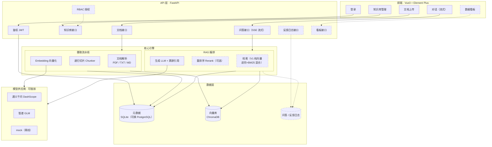
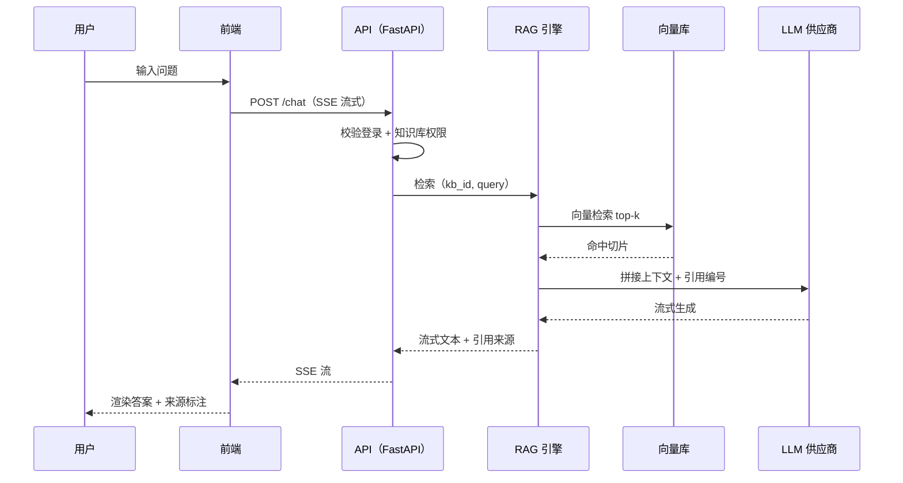
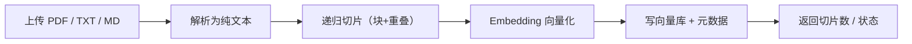

# 系统架构

> 分层架构 + 两条核心数据流（摄取、问答）。
> **V1 只做基础功能**（实线框）；`[进阶]*` 为后续迭代，不阻塞 V1。

## 1. 分层架构（ASCII 版，任何查看器可见）

```text
┌───────────────────────────────────────────────────────────────────────────┐
│                       前端  Vue3 + Element Plus                            │
│   登录   ·   知识库管理   ·   文档上传   ·   对话(流式)   ·   [看板]*          │
└───────────────────────────┬───────────────────────────────────────────────┘
                            │ HTTPS + JWT
                            ▼
┌───────────────────────────────────────────────────────────────────────────┐
│                      API 层  FastAPI                                      │
│   鉴权JWT  [RBAC]*   知识库接口   文档接口   问答接口(SSE)   [反馈]*  [看板]*  │
└───────────────────────────┬───────────────────────────────────────────────┘
                            │
                            ▼
┌───────────────────────────────────────────────────────────────────────────┐
│                             核心引擎                                       │
│   摄取：  文档解析(PDF/TXT/MD) → 递归切片 → Embedding 向量化                  │
│   问答：  检索(纯向量) → [BM25混合]* → [Rerank]* → 生成LLM + 溯源引用         │
└────────────┬────────────────────────────────────────────────┬────────────┘
             │                                                │
             ▼                                                ▼
┌───────────────────────────┐               ┌───────────────────────────────┐
│      元数据  SQLite         │               │    向量库  ChromaDB            │
│  (知识库/文档/切片/用户)    │               │   每个知识库 = 独立集合 kb_{id} │
└───────────────────────────┘               └───────────────┬───────────────┘
                                                            │
                                   ┌────────────────────────┴────────────────┐
                                   │          模型供应商（可插拔）             │
                                   │   通义千问 DashScope  ·  智谱 GLM  · mock │
                                   └─────────────────────────────────────────┘

  [进阶]* = 后续迭代功能，V1 不实现（见 README「迭代路线图」）
```

## 2. 分层架构（mermaid 版，需支持 mermaid 的查看器，如 GitCode/GitHub 网页）



## 3. 问答数据流

**流程（ASCII）**：用户 → 前端 → `POST /chat`(SSE) → 校验登录/权限 → 向量检索 top-k → 拼接上下文 → LLM 流式生成 → 返回答案 + 引用来源



## 4. 摄取数据流

```text
上传(PDF/TXT/MD) → 解析纯文本 → 递归切片(块+重叠) → Embedding → 写向量库+元数据 → 返回切片数/状态
```



## 5. 设计要点

- **知识库隔离**：每个知识库 = 独立向量集合（`kb_{id}`）+ 元数据按 `kb_id` 过滤，天然隔离互不串库
- **模型可插拔**：LLM / Embedding / Rerank 三层抽象，OpenAI 兼容接口对接通义/智谱，mock 离线可测
- **存储抽象**：VectorStore 接口（现 ChromaDB），进阶可换 pgvector / LanceDB；元数据 SQLAlchemy，可换 PostgreSQL
- **可扩展**：检索、重排、生成均为独立组件，混合检索 / Rerank 只需替换/插入对应积木，不动上层

> 💡 **为什么有 ASCII + mermaid 两份**：ASCII 图在任何 Markdown 查看器（本地编辑器、终端）都能显示；mermaid 图在支持它的平台（GitCode/GitHub 网页、VS Code 装「Markdown Preview Mermaid Support」插件后）会自动渲染成正式图形。若你本地想看图，用 GitCode 网页打开本文件，或给 VS Code 装 mermaid 预览插件即可。
